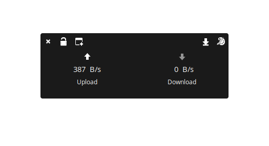
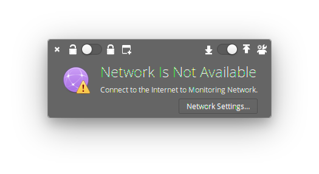
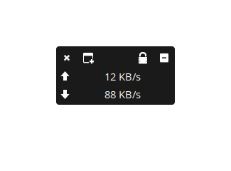

# Nino

Nino is an internet speed monitor with a simple appearance.

Features:

* Small window application features.
* Alert when no internet connection is connected.
* Many color theme choices available.
* lock position on the desktop.
* Save the position of the widget.
* The choice is always above the screen or below.

## Building, Testing, and Installation

You'll need the following dependencies:

* meson
* libgranite-dev
* libgtop2-dev
* gtk+-3.0
* valac

Run `meson` to configure the build environment and then `ninja` to build and run automated tests

    meson build --prefix=/usr
    cd build
    ninja

To install, use `ninja install`, then execute with `com.github.torikulhabib.nino`

    sudo ninja install
    com.github.torikulhabib.nino
